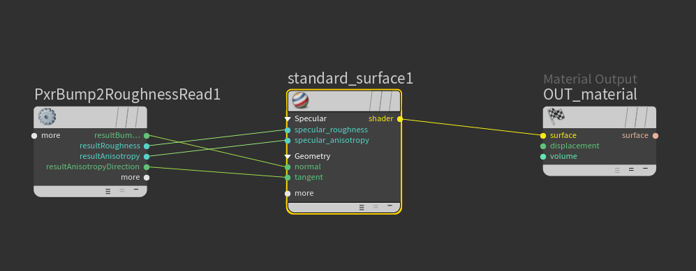

### Arnold-compatible implementation of Pixar's bump-to-roughness workflow
-------
#### Read first

https://rmanwiki.pixar.com/display/REN24/PxrBumpRoughness
https://graphics.pixar.com/library/BumpRoughness/paper.pdf

-------
#### Workflow

Bump to roughness works with texture-based bump maps. First we need to generate a special, 6-channel image of the bump slopes. Life is made easy for us in 2021, since maketx has an option to spit this out: 

`/home/cactus/Arnold-7.0.0.0-linux/bin/maketx' /home/cactus/b2r/scenes/36_scratches_smudges_fingerprints_specs.tif --bumpslopes`

This image becomes the input of the PxrBump2RoughnessRead shader. The pre-computing of this image replaces the PxrBump2RoughnessMake shader.

All that's left now is to plug this image into the shader, and plug the outputs into the correct slots of a standard_surface shader.

-------
#### Ignore

`/home/cactus/Arnold-7.0.0.0-linux/bin/oslc' src/PxrBump2RoughnessMake.osl -o dist/PxrBump2RoughnessMake.oso`

`/home/cactus/Arnold-7.0.0.0-linux/bin/oslc' src/PxrBump2RoughnessRead.osl -o dist/PxrBump2RoughnessRead.oso`

--------
#### Original readme:

Copyright 2017 Pixar

Example implementation code for the Pixar tech memo titled "Geometry into Shading".  This tech memo is currently available at http://graphics.pixar.com/library/BumpRoughness/paper.pdf.

Licensing information can be found in the license.txt file.

At this time, Pixar has no plans to provide support or receive contributions to the example implementation code.

More information:

#### Todo:

- validate if the roughness mapping should completely get removed when viewed at the highest mipmap? Pixar's documentation does mention that there will always be a look difference between this and regular bump mapping.
- generate images showing the main issue it solves
- generate images of the automatic anisotropic mapping